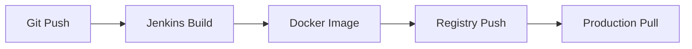

# StudentProject - Django Multi-App with CI/CD Pipeline

## 📦 Docker Setup
```bash
# Build and run locally
docker build -t studentproject .
docker run -p 8000:8000 studentproject
```

## 🛠️ Manual Setup
```bash
python -m venv venv
source venv/bin/activate  # Linux/Mac
venv\Scripts\activate    # Windows
pip install -r requirements.txt
python manage.py runserver
```

## 🔧 Jenkins CI/CD Pipeline Setup

### Prerequisites
1. Jenkins server with:
   - Docker Pipeline plugin
   - Git plugin
   - Credentials Binding plugin

2. In Jenkins:
   ```text
   Manage Jenkins → Credentials → Add:
   - ID: docker-hub-credentials
   - Username: Your Docker Hub username
   - Password: Docker Hub access token (Account Settings → Security)
   ```

### Pipeline Configuration
1. Create a **New Item** → **Pipeline**
2. Under *Pipeline Definition*:
   - Select: *Pipeline script from SCM*
   - SCM: Git
   - Repository URL: `https://github.com/SRCEM-AIM-Class-A/A_41_DurgeshShukla_DjangoApp`
   - Script Path: `Jenkinsfile`

### Pipeline Stages
The included `Jenkinsfile` automates:
1. 🛠️ Build Docker image
2. 🔒 Login to Docker Hub
3. 🚀 Push image to registry
4. 📦 Deploy (optional)

### Triggering Builds
- Manual: *Build Now*
- Automatic: Configure webhooks in GitHub/Bitbucket

## 🌐 Access Applications
| Environment | URL |
|-------------|-----|
| Local Docker | http://localhost:8000 |

## 🚨 Troubleshooting

### Docker Issues
```bash
# Reset build cache
docker system prune -a

# Verify container files
docker run -it studentproject ls -la /app
```

### Jenkins Issues
1. Pipeline fails at Docker step:
   - Verify `docker-hub-credentials` ID matches Jenkinsfile
   - Check Docker Hub rate limits

2. Build hangs:
   - Increase Jenkins executor timeout
   - Allocate more resources to Docker

## 📂 Project Structure
```
.
├── Dockerfile          # Container configuration
├── Jenkinsfile         # CI/CD pipeline
├── app1/               # First Django app
├── app2/               # Second Django app
├── studentproject/     # Main config
└── requirements.txt    # Python dependencies
```

## 🔄 Deployment Workflow


**Note**: For production, add deployment stage in Jenkinsfile after successful build.
```

This README now includes:
1. **Docker** and **manual** setup
2. **Complete Jenkins pipeline** configuration
3. **Troubleshooting** for both Docker and Jenkins
4. **Visual workflow** diagram
5. **Production-ready** structure
